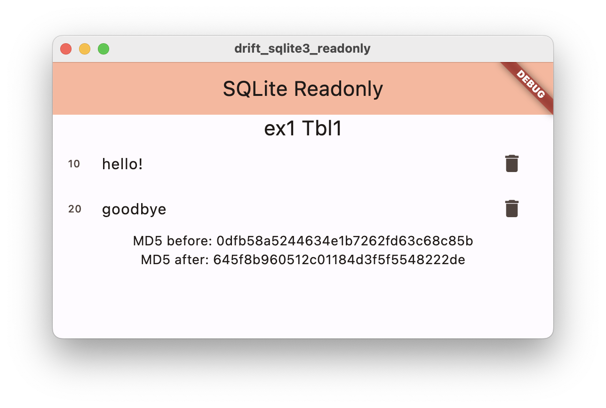
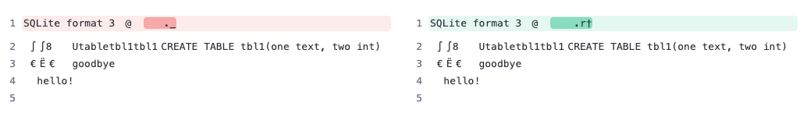
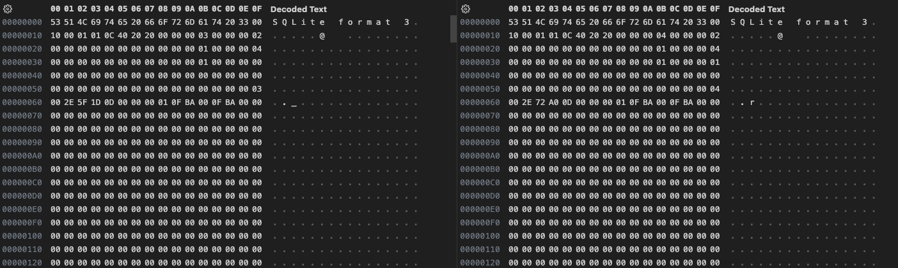

# drift_sqlite3_readonly

## SQLite file is modified with select statements

My goal is to read from an existing SQLite database using Drift on the **Linux** and **MacOS** platforms without modifying the source file. 

However, the database file is modified with the first select statement. Regardless of which data is read or how often this happens, this initial modification remains.

SQLite offers a read-only mode when opening the database, which is provided in the `open` function of the sqlite3.dart library:
https://github.com/simolus3/sqlite3.dart/blob/main/sqlite3/lib/src/sqlite3.dart#L22

Unfortunately, I do not see any possibility to use this read-only mode via drift when opening the SQLite database. However, this is important for me, as the app on the target device (embedded Linux) has read-only access.

I couldn't figure out what kind of change this is, but since I don't have write permissions, it boils down to errors.
What is being written, and how can this be prevented?

Is this a bug or will the passing of database specific options be available in a future version?

Here is the issue: https://github.com/simolus3/drift/issues/2832

## Getting Started

This app is intended to exemplify the behavior described above.

A minimalistic SQLite database named `ex1` was created via sqlite3 CLI (https://www.sqlite.org/cli.html#getting_started):

```bash
$ sqlite3 ex1                                                                                                                                                           
SQLite version 3.39.5 2022-10-14 20:58:05
Enter ".help" for usage hints.
sqlite> create table tbl1(one text, two int);
sqlite> insert into tbl1 values('hello!',10);
sqlite> insert into tbl1 values('goodbye', 20);
sqlite> select * from tbl1;
hello!|10
goodbye|20
sqlite> ^D
$ ll   
total 16
-rw-r--r--  1 arend  staff   8.0K Jan 11 10:02 ex1
$ md5 ex1           
MD5 (ex1) = 0dfb58a5244634e1b7262fd63c68c85b

```

To build and start the project, execute the following commands:

```bash
flutter pub get
dart run build_runner build --delete-conflicting-outputs 
```

For MacOS, access to the file system should still be given. Set `<key>com.apple.security.app-sandbox</key>` to `false` in `macos/Runner/DebugProfile.entitlements`:


```bash
flutter run -d macos
```

The app should appear as follows:



All entries of the table `tbl1` should be listed.

The MD5 checksum of the database file was generated once before and once after the select statement end, which differ as can be seen here.

```log
flutter: database path: ./drift_sqlite3_readonly/lib/database/ex1
flutter: MD5 of database file ex1 BEFORE first read operation: 0dfb58a5244634e1b7262fd63c68c85b
flutter: Drift: Sent SELECT * FROM "tbl1"; with args []
flutter: database path: ./drift_sqlite3_readonly/lib/database/ex1
flutter: MD5 of database file ex1 AFTER first read operation: 0dfb58a5244634e1b7262fd63c68c85b
```


As the database has been changed, a backup is available (`lib/database/ex1_original`) to restore it. To do this, simply execute the following command:

```bash
$ yes | cp ./lib/database/ex1_original ./lib/database/ex1  
```

## Modification

After the app was started, Drift or whatever changed the database as follows:



